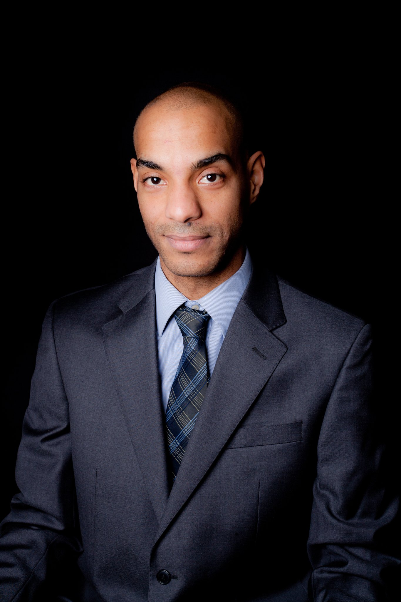

:properties:
:id: 5ADCD11B-45FB-6224-11EB-531B26681143
:end:
#+title: About Me
#+author: Marco Craveiro
#+options: <:nil c:nil todo:nil ^:nil d:nil date:nil author:nil toc:nil html-postamble:nil
#+startup: inlineimages

* Quick Bio

The bio from my [[https://github.com/mcraveiro][GitHub profile]] is still fairly accurate:

#+begin_quote
Dad, Husband, Computer Science PhD, Senior Software Engineer, FX Derivatives
geek, Angolan-Portuguese.
#+end_quote

* Programming

I've spent a quarter of a century programming professionally, almost all of
which in the United Kingdom --- though I did do a couple of quick escapades to
Angola and Portugal. My main focus over the last twenty or so years has been the
financial sector --- the FX derivatives market in particular. I am currently
gainfully employed and therefore not looking for opportunities.

* Academia

I did a PhD thesis which may (or may not) be of interest: [[https://uhra.herts.ac.uk/handle/2299/25708][Model Assisted
Software Development --- a MDE-Based Software Development Methodology]]. As part
of that work, I wrote a few papers:

- [[https://zenodo.org/records/5790875#.YkoSutDMKXI][Survey of Special Purpose Code Generators]]
- [[https://zenodo.org/records/5767247#.YkoS6NDMKXI][Experience Report of Industrial Adoption of Model Driven Development in the
  Financial Sector]]
- [[https://zenodo.org/records/5812017#.YkmlftDMKXI][Notes on Model Driven Engineering]]

In my spare time I used to work on this topic over at the [[file:dogen/index.org][MASD Project]], but
these days I am more likely to be found at [[https://github.com/OreStudio/OreStudio][ORE Studio]] playing around with LLMs
and [[id:8BF323A0-B868-7AA4-EC7B-D988934482AA][Computational Finance]]. My /[[https://en.wikipedia.org/wiki/Alma_mater][almae matres]]/ are: [[https://www.herts.ac.uk/][University of Hertfordshire]]
(PhD, MsC) and [[https://www.ualg.pt/][Universidade do Algarve]] - Escola Superior de Gestão, Hotelaria e
Turismo (ESGHT) (BSc).

* Work

After working for over two decades for [[https://www.natwestgroup.com/who-we-are/board-and-governance/our-subsidiaries/natwest-markets-plc.html][Natwest Markets]] --- as both a contractor,
and a permie, and a contractor a few times, and a permie to finish off --- I am
now no longer in the City of London. It has been a very big change for me, since
I worked in the city for roughly 25 years of my life, or just about half of it
so far. I do try to keep my hands busy with Quantitative Finance in my spare
time via [[https://github.com/OreStudio/OreStudio][ORE Studio]]. I otherwise work as a remote Senior Software Engineer.

* Languages

My mother tongue is Portuguese, but I speak English fluently enough (though my
kids may tell you otherwise). I can survive in Spanish and, if really pushed,
rather badly in French. My favourite expression, which I heard our [[https://en.wikipedia.org/wiki/Democratic_Republic_of_the_Congo][Congolese
neighbours]] say a lot is /Je me débrouille/.

#+caption: Profile picture. (C) 2020 Shahinara Craveiro.
#+name: fig-gotch
#+attr_html: :width 50% :height 50% :align center

