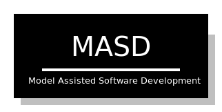

:properties:
:id: 11F938FF-2A01-4424-DBE3-16527251E747
:end:
#+title: Dogen
#+options: <:nil c:nil todo:nil ^:nil d:nil date:nil author:nil toc:nil html-postamble:nil
#+startup: inlineimages
#+cite_export: basic author author-year
#+bibliography: docs/bibliography.bib

This site contains all of the product documentation for [[https://github.com/MASD-Project/dogen][Dogen]], the Model
Assisted Software Development (MASD) code generator. MASD is a methodology to
develop software systems[fn:thesis] based on [[id:C29C6088-B396-A404-9183-09FE5AD2D105][MDE - Model Driven Development]].
Throughout this site you will find all the information needed to make sense of
these and many other terms, as well as the rationale for the existence of
Dogen. This project makes heavy use of the [[https://www.orgroam.com/manual.html][org-roam]] approach, though if you
are consuming it from within a web-browser, it should not make much difference.

[fn:thesis] MASD was developed as part of my PhD thesis. See [[id:5FA85AF3-E55C-B174-D943-1E2246CAEB14][MASD Academic
Papers]].

* Content

** General Pages

| Page   | Description                                       |
|--------+---------------------------------------------------|
| [[id:BA763158-3DC5-E914-BF2B-5C9CABBC3676][Readme]] | Overview of the Dogen project.                    |
| [[id:D89B0BFC-1141-4A36-AB37-65A6E6A8C2B5][Videos]] | YouTube playlists with Dogen demos and lectures.  |

** Domain Concepts

This project was originally part of an academic research project, so a lot of
documentation was created describing the domain which it covers. The sections
that follow contain an overview of the main pages, which are then weaved
together using the [[https://www.orgroam.com/manual.html][org-roam]] approach. To access the original material, see [[id:5FA85AF3-E55C-B174-D943-1E2246CAEB14][MASD
Academic Papers]].

*** Model Driven Engineering

MASD is based on [[id:C29C6088-B396-A404-9183-09FE5AD2D105][Model Driven Engineering (MDE)]], so its important to understand
the basic concepts of this field and why we found it necessary to extend it.

| Page                                      | Description                                                                |
|-------------------------------------------+----------------------------------------------------------------------------|
| [[id:4B0DC013-F222-5BB4-33DB-C53414604801][Acronyms]]                                  | List of commonly used TLAs.                                                |
| [[id:C29C6088-B396-A404-9183-09FE5AD2D105][Towards a Definition of MDE]]               | Exploration of the literature towards attaining a definition of this term. |
| [[id:C807836B-B1D6-1024-86E3-7D49BCF20D74][Models and Transformations]]                | Definition of [[id:C29C6088-B396-A404-9183-09FE5AD2D105][MDE]]'s core concepts, and rationale for their usage.          |
| [[id:CA232302-65F9-6DE4-AD4B-6D24EE3E9D39][From Problem Space to Solution Space]]      | Characterisation of problem space and solution space.                      |
| [[id:E5EA2B40-5526-0E44-B6D3-8F817E21C984][MDE and the Software Development Process]]  | How [[id:C29C6088-B396-A404-9183-09FE5AD2D105][MDE]] integrates with [[id:8E4D171C-1FAE-FA74-0EA3-97F1125B8A2A][SDM]]s.                                              |
| [[id:3DD5C3FF-5BC2-F8A4-2A6B-4F037A78D8E6][MDE and Variability Modeling]]              | How [[id:C29C6088-B396-A404-9183-09FE5AD2D105][MDE]] integrates with variability modeling approaches.                   |
| [[id:ABA49482-2E5D-2CA4-6813-5F0C8B868F8E][Survey of Special Purpose Code Generators]] | Survey of [[https://en.wikipedia.org/wiki/Free_and_open-source_software][FOSS]] tools dedicated to special purpose code generation          |
| [[id:A277E33A-FBA3-0EF4-7F1B-79D38D6820E4][Experience Report of Industrial Adoption]]  | Experience report analysing [[id:79EC741E-8818-3494-8B1B-2B27C182B160][MDD]] techniques applied to financial sector.    |
| [[id:6EBDB35D-8892-8964-6D03-393E013B74BA][State of the Art in Code Generation]]       | Analysis on the importance of code generation and existing methodologies.  |
| [[id:3310548C-2A30-0FA4-71F3-6E31EB98D498][The State of MDE Adoption]]                 | Analysis of the practicalities of MDE adoption.                            |
| [[id:8EFC0922-AD38-9514-538B-88C0EF9F730E][Requirements for a new Methodology]]        | Requirements for the MASD methodology.                                     |
| [[id:EE673330-E634-3294-54E3-BBE3A4D741BE][The MASD Methodology]]                      | Definition of the MASD methodology.                                        |
| [[id:1F62296F-DE7E-489C-876D-48FE1FC6321C][Literate Modeling with org-model]]           | MASD's approach to literate modeling using org-mode.                       |
| [[id:28172515-59C8-458A-B9CF-B0DCC48BB0EC][MASD Reference Implementation]]             | Dogen code generator and its reference products.                           |
